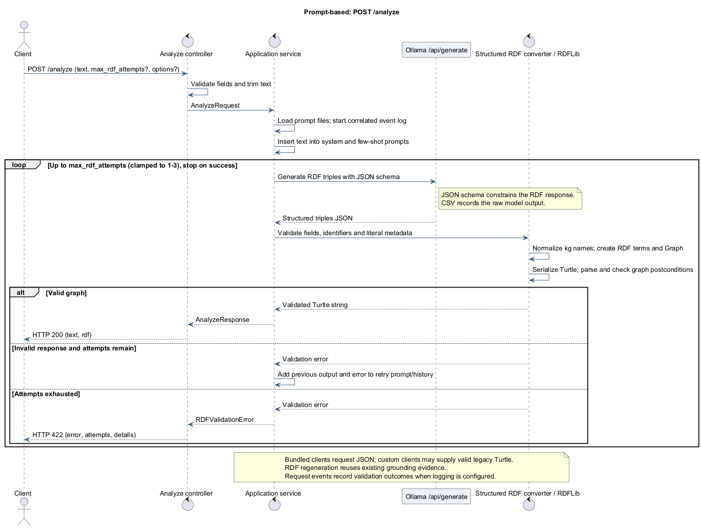
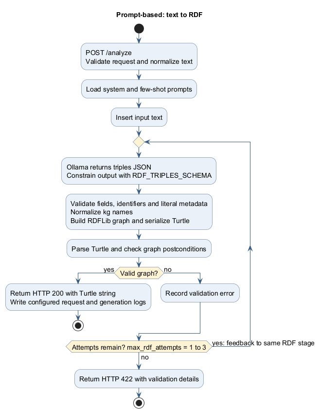

# Prompt-based Knowledge Graph Construction API

Small Flask API that accepts text, combines it with prompt templates, asks Ollama for structured RDF triples as JSON, builds the graph with `rdflib`, and returns a serialized Turtle string. The project ships with a system prompt and a few-shot prompt for knowledge-graph construction.

This is the prompt-only baseline in the evaluation workspace. It does not query
Wikidata or inject external graph evidence, which isolates the contribution of
the prompt and model from the ontology-grounded and hybrid variants.

The default prompts require the shared structured-triple JSON contract used by all three
pipelines. The ontology variant adds Wikidata-grounding instructions; Turtle syntax is generated
deterministically by RDFLib instead of by the model.

## Quick start

Requirements: Python 3.12 and a running Ollama instance with the
configured model.

```bash
ollama pull llama3.1:8b
python -m pip install -e ".[dev]"
python -m prompt_based
```

In another terminal:

```bash
curl -X POST http://127.0.0.1:5000/analyze \
  -H "Content-Type: application/json" \
  -d '{"text":"Alice knows Bob.","max_rdf_attempts":3}'
```

## Process Flow

[Process figure and sequence diagram](docs/diagrams.md)

## Project Layout
- `src/prompt_based/` - importable application package, organized into controller,
  application, domain, and infrastructure layers.
- `prompt/system/` - System prompts that define LLM behavior and output constraints.
- `prompt/prompts/` - User prompt templates. The default template includes the `${USER_TEXT}` placeholder.
- `docs/` - Endpoint, run, test, and sequence documentation.
- `tests/` - Unit and integration tests.

## Sequence Diagram 



## API Summary

### `GET /health`

Returns service status and Ollama/model availability.

### `POST /analyze`

Receives text and returns valid RDF/Turtle serialized from the model's structured triples.

Request body:

```json
{
  "text": "Alice knows Bob.",
  "prompt_name": "prompts/few-shot.txt",
  "system_prompt_name": "system/knowledge_graph.txt",
  "max_rdf_attempts": 3
}
```

Only `text` is required. Prompt names are resolved inside the `prompt/` directory. `max_rdf_attempts` is capped at 3 and controls how many times the same model stage may regenerate invalid structured triples before returning an error.

Success response:

```json
{
  "text": "Alice knows Bob.",
  "rdf": "@prefix rdfs: <http://www.w3.org/2000/01/rdf-schema#> .\n..."
}
```

See [docs/analyze.md](docs/analyze.md) for the full endpoint contract.

See [docs/prompt.md](docs/prompt.md) for an explanation of the system prompt, few-shot prompt, placeholders, prefixes, and prompt editing guidelines.

## Development quality checks

Install the development dependencies with `python -m pip install -e ".[dev]"`,
then run `python -m ruff format --check .`, `python -m ruff check .`,
`python -m pyright`, and `python -m pytest`. GitHub Actions runs the same checks on pushes
and pull requests with Python 3.12.

## LLM Configuration

| Variable                    | Description                               | Type                | Default/Example Value            |
|-----------------------------|-------------------------------------------|---------------------|----------------------------------|
| DEFAULT_PROMPT_NAME         | Path to the shared-core few-shot prompt   | String              | prompts/few-shot.txt             |
| DEFAULT_SYSTEM_PROMPT_NAME  | Path to the system prompt                 | String              | system/knowledge_graph.txt       |
| OLLAMA_API_URL              | Ollama API URL                            | String              | http://localhost:11434           |
| OLLAMA_MODEL                | LLM model name                            | String              | llama3.1:8b                      |
| OLLAMA_CSV_PATH             | Path to the response log CSV file         | String              | data/ollama_responses.csv        |
| OLLAMA_SEED                 | Seed for reproducibility                  | Integer (optional)  | -                                |
| OLLAMA_TEMPERATURE          | Sampling temperature                      | Float (optional)    | -                                |
| OLLAMA_TOP_K                | Top-K sampling                            | Integer (optional)  | -                                |
| OLLAMA_TOP_P                | Top-P (nucleus sampling)                  | Float (optional)    | -                                |
| OLLAMA_MIN_P                | Minimum probability threshold             | Float (optional)    | -                                |
| OLLAMA_STOP                 | Stop sequence                             | String (optional)   | -                                |
| OLLAMA_NUM_CTX              | Context window size                       | Integer (optional)  | -                                |
| OLLAMA_NUM_PREDICT          | Maximum number of tokens to generate      | Integer (optional)  | unset; Compose uses 1536          |
| OLLAMA_TIMEOUT_SECONDS      | HTTP timeout for Ollama requests          | Integer             | 180; Compose uses 660             |
| ANALYZE_LOG_PATH            | JSONL request-event log path              | Path                | data/analyze_log.jsonl            |

## Generated Output and Logs

- The model is called through Ollama `/api/generate` with `stream:false`.
- Ollama is constrained with a JSON schema. The application validates each structured triple,
  builds an RDFLib graph, serializes it to Turtle, and parses the result before returning it.
- The system and user prompts share the same structured-triple fields and identifier rules used
  by the ontology and hybrid pipelines.
- Successful generations are written to the CSV configured by `OLLAMA_CSV_PATH`.
- Request lifecycle and strict RDF-validation events are written as JSON Lines to `ANALYZE_LOG_PATH`, correlated by `idempotence_key`.
- The public API returns only the original `text` and the validated `rdf` string.

## Pipeline documentation



See [sequence diagram and regeneration instructions](docs/diagrams.md) and [structured RDF contract](docs/structured-rdf.md).
